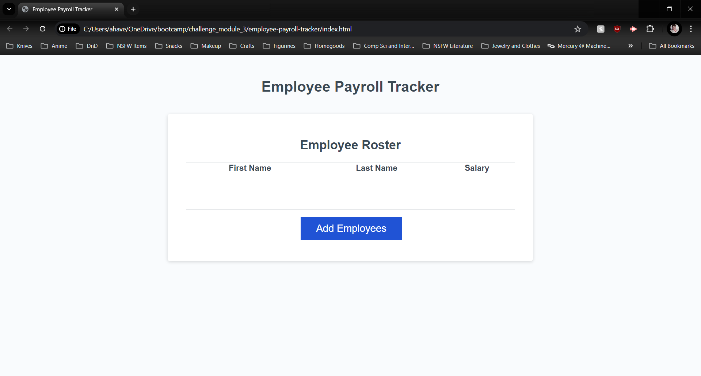
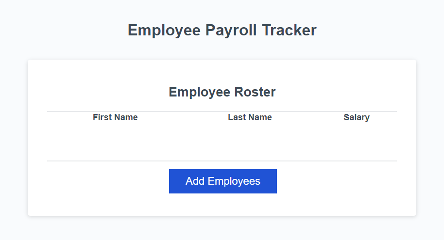
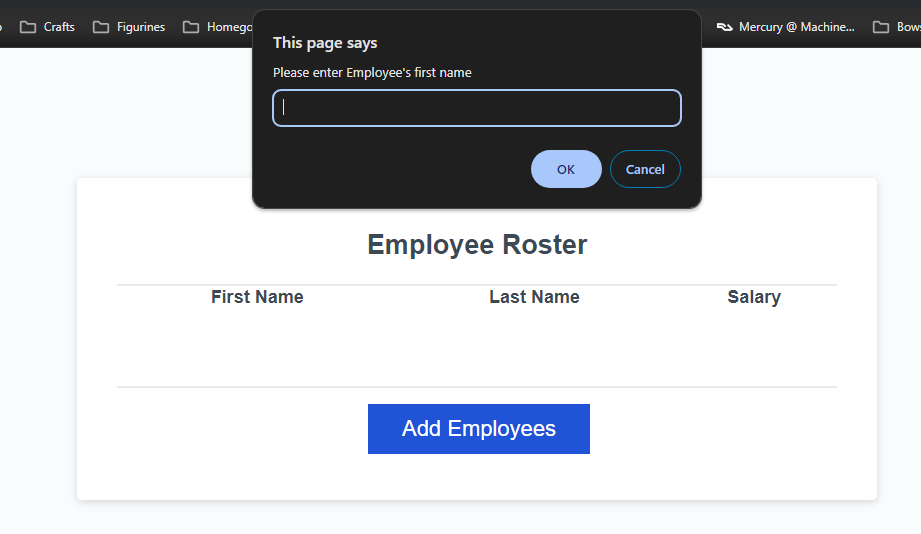
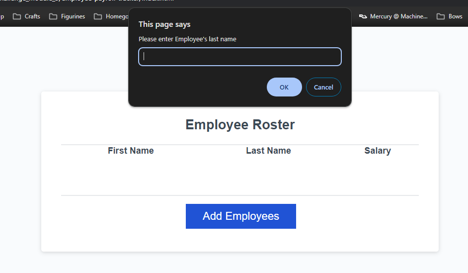
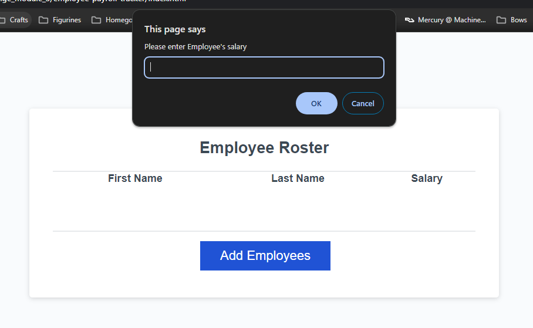
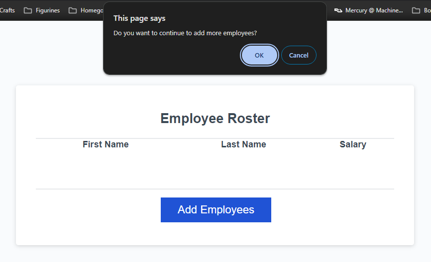
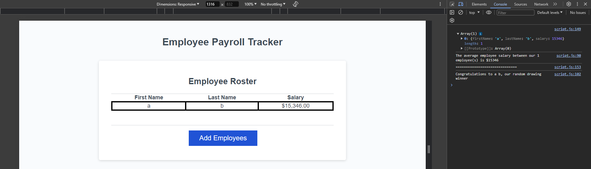

# Table of Contents
- [Description](#description)
    - [Built With](#built-with)
- [Getting Started](#getting-started)
- [Usage](#usage)
- [License](#license)
- [Contact](#contact)

# Description
This project allows a user to submit mutliple employees and their salaries. Once submitted, the user can then inspect the page to view the average salary and a random employee.

## Built with
Project built with:
* JavaScript
* HTML
* CSS

# Getting Started 
To use the payroll tracker, perform the following:
1. Open the github page: https://ahavens1995.github.io/employee-payroll-tracker/
    
2. Use the 'Add Employee' Button and enter:
    * Employee First Name \
        
    * Employee Last Name \
        
    * Salary of the Employee \
        
3. If you want to continue adding more employees, select OK and repeat step 2. \
    
4. After you finish adding employees, right click the page and select Inspect.
5. Select Console in the tools
6. Verify the console outputs:
    * The array of employees
    * The average salary of all the employees
    * A random employee \
    

# Usage
Please use this as an initial look into how Javascript functions and methods interact with HTML and CSS.

# License
No license has been used

# Contact
Aurora Havens
https://github.com/ahavens1995/employee-payroll-tracker